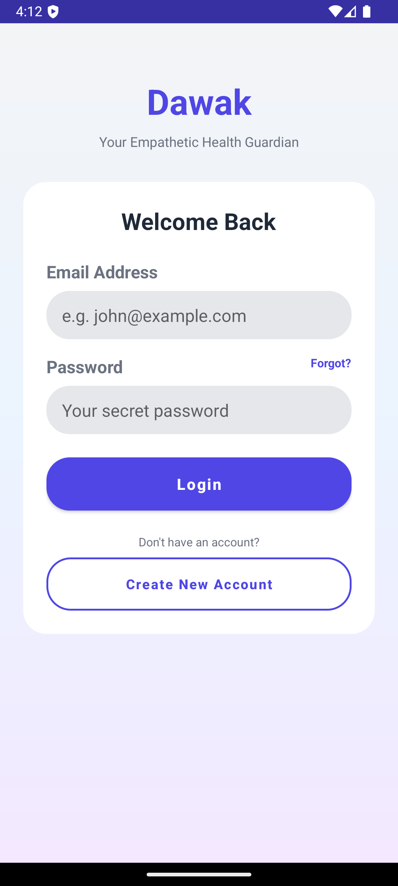
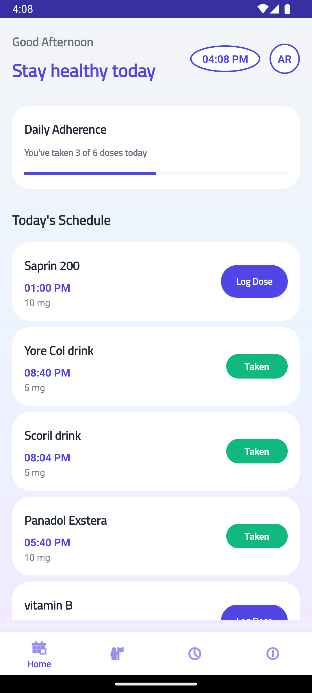
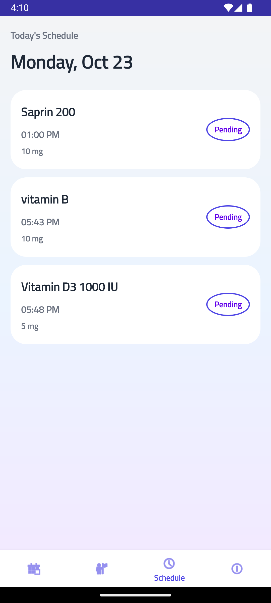
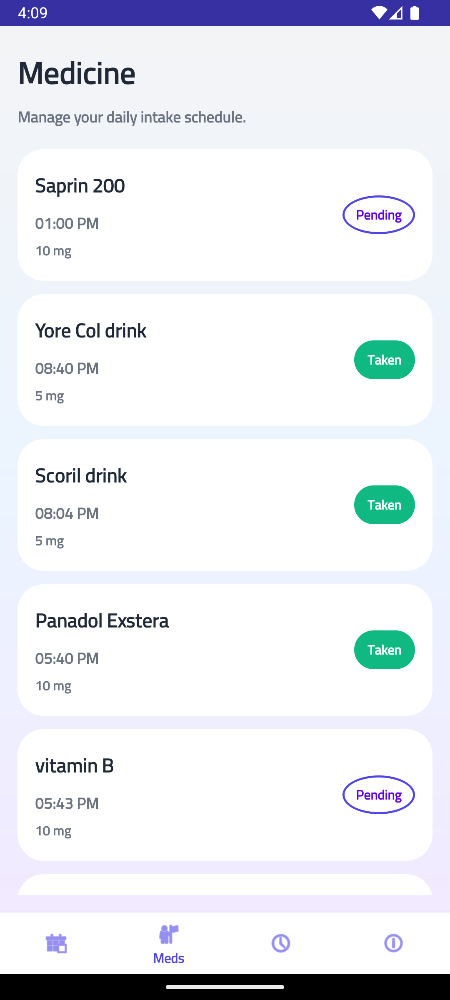
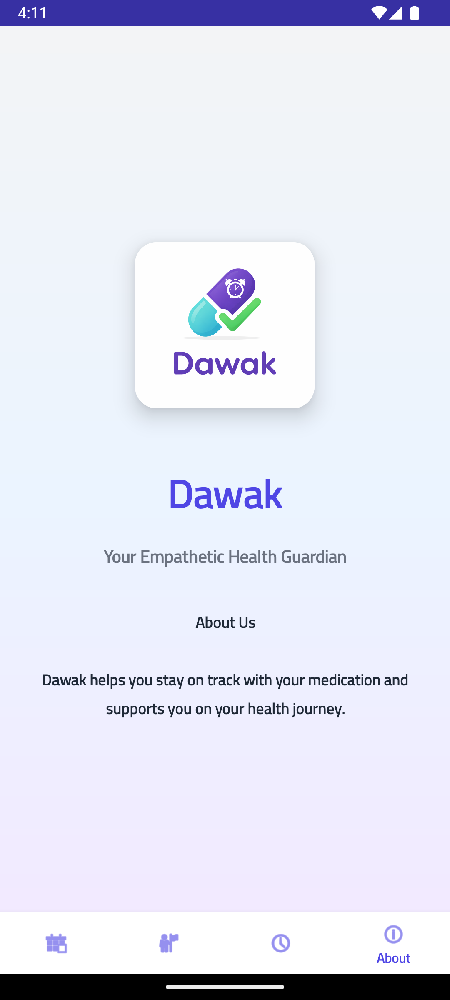

# 💊 Dawak - Medication Reminder App

## 📌 Overview

Dawak is a mobile application designed to help users manage their medications effectively and maintain a healthy lifestyle. The app allows users to add medicines, schedule reminders, and receive notifications to ensure that doses are taken on time.

The application is simple, user-friendly, and works completely offline using a local SQLite database.

---

## 🎯 Features

* Add and manage medications
* Schedule medication reminders
* Receive notifications at the correct time
* Track daily medication adherence
* Mark doses as Taken or Pending
* Clean and user-friendly interface
* Works offline

---

## 🛠️ Technologies Used

* Java
* Android Studio
* XML (UI Design)
* SQLite Database
* AlarmManager

---

## 📸 Screenshots

### 🔐 Login Screen



### 📝 Register Screen


### 🏠 Dashboard



### 📅 Schedule Screen



### 💊 Medicines Screen



### ℹ️ About Screen



---

## 🚀 How to Run the Project

1. Clone the repository:

```bash
git clone https://github.com/salehff21/dawak-app.git
```

2. Open the project in Android Studio

3. Wait for Gradle to sync

4. Run the app on an emulator or a real Android device

---

## 📂 Project Structure

* Activities → Handle user interaction
* Fragments → Manage UI components
* DatabaseHelper → Handle SQLite operations
* AlarmReceiver → Handle notifications
* SessionManager → Manage user sessions

---

## 👨‍💻 Developer

**Saleh Al-Shouibi**

---

## 📌 Project Purpose

This project was developed as a graduation project to provide a simple and effective solution for medication management and improve patient adherence.

---

## ⭐ Future Improvements

* Add cloud synchronization
* Improve UI/UX design
* Add multi-language support
* Add medication history tracking

---
